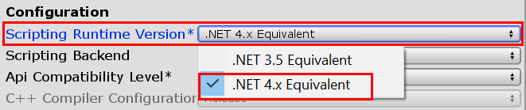

# Unity Scripting Upgrade

C# and .NET, the technologies underlying Unity scripting, have continued to receive updates since Microsoft originally released them in 2002. But Unity developers may not be aware of the steady stream of new features added to the C# language and .NET Framework. That's because prior to the release of Unity 2017.1, Unity has been using a .NET 3.5 equivalent scripting runtime, missing years of updates!

With the release of Unity 2017.1, Unity introduced an experimental version of its core scripting runtime upgraded to a .NET 4.6, C# 6 compatible version. In Unity 2018.1, the .NET 4.x equivalent runtime is no longer considered "experimental" and has been rebranded as "stable," while the older .NET 3.5 equivalent runtime is now considered "legacy." And with the release of Unity 2018.3, Unity is projecting to make the upgraded scripting runtime the default selection, and update even further to C# 7. For more information and the latest updates on this roadmap, you can visit Unity's [Experimental Scripting Previews forum](https://forum.unity.com/forums/experimental-scripting-previews.107/). In the meantime, check out the sections below to learn more about these new features and how to use them.

## Prerequisites

* [Unity 2017.1 or above](https://unity3d.com/)
* [Visual Studio 2017](https://visualstudio.microsoft.com/downloads/)

## Enabling the .NET 4.x scripting runtime in Unity

1. Open PlayerSettings in the Unity Inspector by selecting **Edit > Project Settings > Player**.

1. Under the **Configuration** heading, click the **Scripting Runtime Version** dropdown and select **.NET 4.x Equivalent**.



## Feature highlights

### Auto-property initializers

In C#, [properties](https://unity3d.com/learn/tutorials/topics/scripting/properties) are the preferred method for exposing ways to get or set values. In Unity's .NET 3.5 scripting runtime, the auto-property syntax makes it easy to quickly define uninitialized properties, but initialization has to happen elsewhere in your script. Now with the .NET 4.x runtime, it's possible to initialize auto-properties in the same line:

```csharp
// .NET 3.5
public int Health { get; set; } // Health has to be initialized somewhere else, like Start()

// .NET 4.x
public int Health { get; set; } = 100;
```

### String interpolation

With the older .NET 3.5 runtime, string concatenation required awkward syntax. Now with the .NET 4.x runtime, the [`$` string interpolation](https://docs.microsoft.com/en-us/dotnet/csharp/language-reference/tokens/interpolated) feature allows expressions to be inserted into strings in a more direct and readable syntax:

```csharp
// .NET 3.5
Debug.Log(String.Format("Player health: {0}", Health)); // or
Debug.Log("Player health: " + Health);

// .NET 4.x
Debug.Log($"Player health: {Health}");
```

### Expression-bodied members

With the newer C# syntax available in the .NET 4.x runtime, [lambda expressions](https://docs.microsoft.com/en-us/dotnet/csharp/programming-guide/statements-expressions-operators/lambda-expressions) can replace the body of functions to make them more succinct:

```csharp
// .NET 3.5
private int TakeDamage(int amount)
{
    return Health -= amount;
}

// .NET 4.x
private int TakeDamage(int amount) => Health -= amount;
```

You can also use expression-bodied members in read-only properties:

```csharp
// .NET 4.x
public string PlayerHealthUiText => $"Player health: {Health}";
```

### Null-conditional operator

The [`?.` null-conditional operator](https://docs.microsoft.com/en-us/dotnet/csharp/language-reference/operators/null-conditional-operators) simplifies the syntax for checking for null values. With .NET 4.x, it takes less code to guard against missing component and null reference exceptions:

```csharp
// .NET 3.5
private void OnTriggerEnter(Collider other)
{
    if (other.attachedRigidbody != null)
        other.attachedRigidbody.AddForce(Vector3.forward * 100);
}

// .NET 4.x
private void OnTriggerEnter(Collider other)
{
    other.attachedRigidbody?.AddForce(Vector3.forward * 100);
}
```

This works well with the C# [events](https://docs.microsoft.com/en-us/dotnet/csharp/programming-guide/events/) feature:

```csharp
// .NET 3.5
if (PlayerRespawned != null)
    PlayerRespawned.Invoke();

// .NET 4.x
PlayerRespawned?.Invoke();
```

### Task-based Asynchronous Pattern (TAP)

[Asynchronous programming](https://docs.microsoft.com/en-us/dotnet/csharp/async) allows time consuming operations to take place without causing your application to become unresponsive. This functionality also allows your code to wait for time consuming operations to finish before continuing with subsequent code that should not execute until the time consuming operation has finished. For example, you could wait for a file to load or a network operation to complete.

In Unity, this is typically accomplished with [coroutines](https://docs.unity3d.com/Manual/Coroutines.html). However, since C# 5, the preferred method of asynchronous programming in .NET development has been the [Task-based Asynchronous Pattern (TAP)](https://docs.microsoft.com/en-us/dotnet/standard/asynchronous-programming-patterns/task-based-asynchronous-pattern-tap) using the `async` and `await` keywords with [System.Threading.Task](https://docs.microsoft.com/en-us/dotnet/api/system.threading.tasks.task).

```csharp
// Unity coroutine
private void Start()
{
    StartCoroutine(WaitOneSecond());
    DoMoreStuff(); // This executes without waiting for WaitOneSecond
}
private IEnumerator WaitOneSecond()
{
    yield return new WaitForSeconds(1.0f);
    Debug.Log("Finished waiting.");
}
```

```csharp
// .NET 4.x async-await
private async void Start()
{
    Debug.Log("Wait.");
    await WaitOneSecondAsync();
    DoMoreStuff(); // Will not execute until WaitOneSecond has completed
}
private async Task WaitOneSecondAsync()
{
    await Task.Delay(TimeSpan.FromSeconds(1));
    Debug.Log("Finished waiting.");
}
```

TAP is a complex subject, with Unity-specific nuances developers should consider. As a result, TAP is not a universal replacement for coroutines in Unity; however, it is another tool to leverage. The scope of this feature is beyond this article, but some general best practices and tips are provided below:

#### Getting started reference for TAP with Unity

* Asynchronous functions intended to be awaited should have the return type [`Task`](https://docs.microsoft.com/en-us/dotnet/api/system.threading.tasks.task) or [`Task<TResult>`](https://docs.microsoft.com/en-us/dotnet/api/system.threading.tasks.task-1).
* Asynchronous functions that return a task should have the suffix **"Async"** appended to their names. This helps indicate that they should always be awaited.
* Only use the `async void` return type for functions that fire off async functions from traditional synchronous code. Such functions are not awaited and should not have the "Async" suffix in their names.
* Unity uses the UnitySynchronizationContext to ensure async functions run on the main thread by default. The Unity API is not accessible outside of the main thread.
* It is possible to run tasks on background threads with methods like [`Task.Run`](https://msdn.microsoft.com/library/hh195051.aspx) and [`Task.ConfigureAwait(false)`](https://msdn.microsoft.com/library/system.threading.tasks.task.configureawait.aspx). This is useful for offloading expensive operations from the main thread to enhance performance, but can lead to difficult to debug problems, and the Unity API is not accessible.

#### Differences between coroutines and TAP

* Coroutines cannot return values, but `Task<TResult>` can.
* You cannot put a `yield` inside of a try-catch statement, making error handling difficult with coroutines. However, try-catch works with TAP.
* Unity's coroutine feature is not available in classes that don't derive from MonoBehaviour. TAP is great for asynchronous programming in such classes.
* At this point, Unity does not suggest TAP as a wholesale replacement of coroutines, and profiling is the only way to know the specific results of one approach versus the other for any given project.

